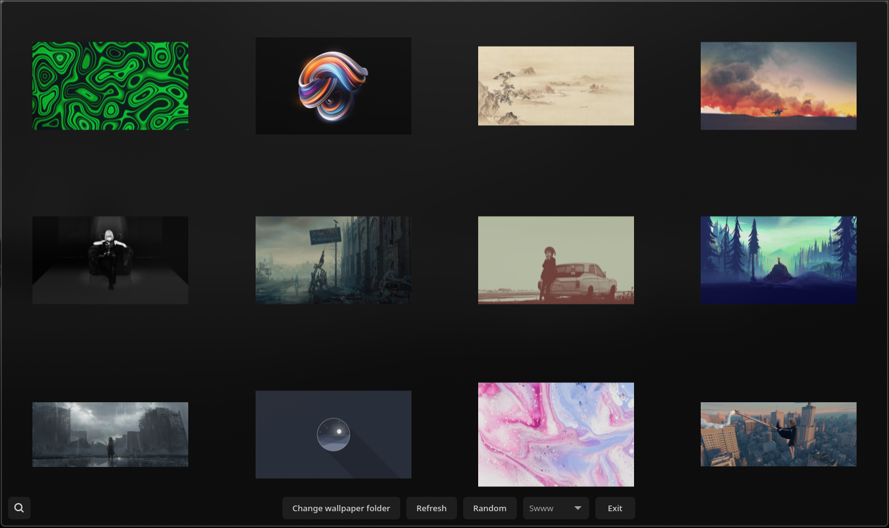

## Hyprwall 🦀
An unofficial GUI for setting wallpapers with Hyprpaper, built with GTK4 and Rust. 🚀🦀 

## Differences between other GUI wallpaper pickers:
- **Rust** - Built with Rust, so it's blazingly fast and memory-safe.
- **No dependencies** - Unlike other GUI wallpaper pickers, Hyprwall doesn't have any package dependencies (other than rust), so it's lightweight and easy to install.
- **Minimalist** - Hyprwall is minimalist the source code is very small compared to other wallpaper pickers e.g. (waypaper).
- **Wrapping** - Hyprwall supports wrapping, so if you choose to you can have all wallpapers shown in the GUI at once (depends on window size).

## Requirements
- Hyprland with IPC enabled
- Hyprpaper installed

## Installation

### GitHub Releases
See Hyprwall's [releases page](https://github.com/nnyyxxxx/hyprwall/releases) for downloadable binaries.

## Building from source
1. Install Rust (preferably `rustup`) through your distro's package or [the official script](https://www.rust-lang.org/tools/install)
2. Install `git`, `pango`, and `gtk4`
3. Clone this repository:
`git clone https://github.com/nnyyxxxx/hyprwall && cd hyprwall`
4. Compile the app with `cargo build --release` or run it directly with `cargo run --release`

## TODO:
- [x] Implement GUI
- [x] Implement wrapping

## Credits:
- [Nyx](https://github.com/nnyyxxxx) - Implementing the GUI and maintaining the project
- [Vaxry](https://github.com/vaxerski) - Hyprpaper
- [rust-gtk](https://github.com/gtk-rs/gtk4-rs) - The GTK4 library
- [Hyprland](https://github.com/hyprwm/Hyprland) - The window manager
